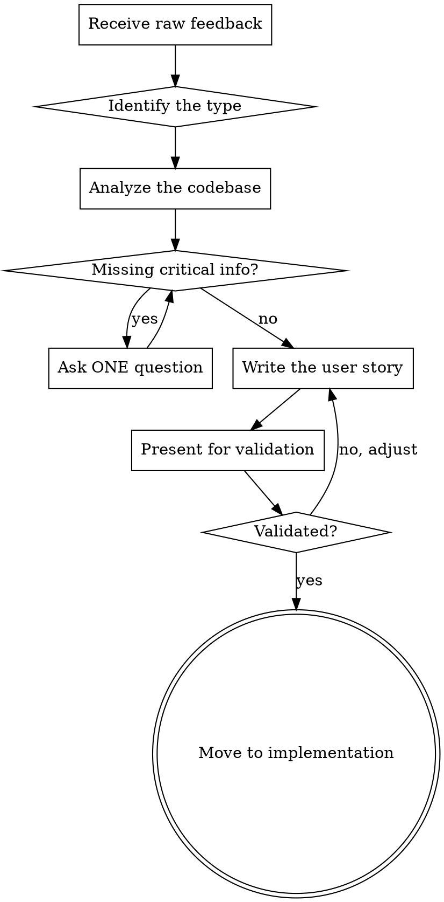

# User Story Builder

Turns raw, informal, sometimes half-slang feedback into a structured, actionable user story. The goal: any agent or developer can implement it perfectly without asking a single question.

## When to use

- The user describes a bug, a feature, a fix, or a deletion in natural language
- The message is informal, incomplete, or mixes several requests together
- Before starting brainstorming or plan writing on a user request

## Process



## Request types

| Type | Prefix | User signal |
|------|--------|-------------|
| **Feature** | `feat:` | "I want", "add", "create", "we should have" |
| **Bugfix** | `fix:` | "it doesn't work", "error", "bug", "crash" |
| **Improvement** | `improve:` | "it's slow", "it's ugly", "not practical" |
| **Deletion** | `remove:` | "drop", "delete", "get rid of", "we don't care about" |
| **Refactor** | `refactor:` | "it's a mess", "clean up", "reorganize" |

## Output format

Present the user story in this exact format:

```
## [type]: [short, clear title]

**As a** [user/dev/system]
**I want** [precise action]
**So that** [concrete benefit]

### Context
- Current situation (what exists / what's wrong)
- Files involved: `path/file.ts:lines`

### Acceptance criteria
- [ ] AC1: [verifiable expected behavior]
- [ ] AC2: [verifiable expected behavior]
- [ ] AC3: [verifiable expected behavior]

### Test scenarios
- test_[function]_[scenario]: [what is being checked]
- test_[function]_[scenario]: [what is being checked]

### Out of scope
- [What we are NOT doing in this story]
```

## Rules

1. **ONE story = ONE thing.** If the feedback contains several requests, split it into separate stories and present them all.

2. **Explore the code BEFORE writing.** Read the relevant files to:
   - Identify the exact files and lines to modify
   - Understand the current behavior
   - Detect potential side effects

3. **Infer as much as possible, ask as little as possible.** The user gives intent, not specs. Use project context and existing code to fill the gaps. Ask a question ONLY when an ambiguity completely blocks the writing.

4. **Testable acceptance criteria.** Each AC must translate directly into a test assertion. No "it should be better", rather "response time < 2s" or "the button shows X when Y".

5. **Name the tests.** Follow the project's convention: `test_[function]_[scenario]` with suffixes like `_nominal`, `_empty`, `_error`.

6. **Explicit out of scope.** Always state what is NOT being done, to prevent scope creep.

7. **Language.** Write the story in the user's language, keeping technical terms and code identifiers verbatim.

## Example

**User input:**
> "the chat sends when i hit enter on my phone instead of doing a line break its annoying"

**Output:**

```
## fix: Enter on mobile sends the message instead of inserting a line break

**As a** mobile user
**I want** to insert line breaks with the Enter key of the virtual keyboard
**So that** I can write multi-line messages without sending them by accident

### Context
- Currently `handleKeyDown` in `Chat.tsx:167` and `Onboarding.tsx:78` sends on Enter unless Shift is held
- On mobile, the virtual keyboard has no accessible Shift key, so Enter always sends
- On mobile, sending must happen only through the send button

### Acceptance criteria
- [ ] AC1: On a touch device, the Enter key inserts a line break
- [ ] AC2: On a touch device, only the send button sends the message
- [ ] AC3: On desktop, Enter still sends (Shift+Enter for a line break)
- [ ] AC4: The `enterKeyHint="send"` attribute is present on the textarea

### Test scenarios
- test_handleKeyDown_mobile_enter: Enter on a touch device does not send
- test_handleKeyDown_desktop_enter: Enter on desktop sends
- test_handleKeyDown_desktop_shift_enter: Shift+Enter on desktop does not send

### Out of scope
- Changing the desktop behavior
- Adding a Ctrl+Enter shortcut
```

## After validation

Once the user story is validated by the user:
1. If simple (1-2 files, targeted change) -> implement directly with TDD
2. If complex (multi-file, architectural) -> chain into a plan-writing workflow
3. If several stories -> prioritize them with the user, then execute in sequence
